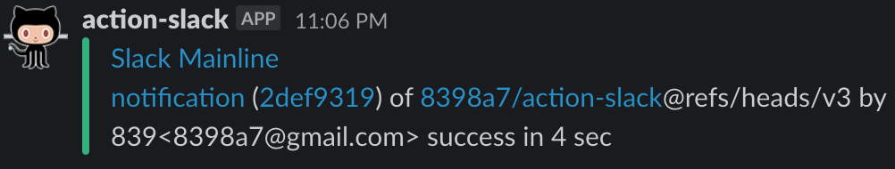

# Notification sur slack

## Résultat



## Comment exécuter ?

Il suffit d'activer le trigger de l'action à savoir un "push".

Cependant pour push il faut pouvoir avoir un commit.

Vous connaissez peut être les "dummy commit" qui sont des modifications mineurs, un espace par ci, juste pour pouvoir créer un commit.

Mais ici, on fait les choses proprement pourquoi faire un faux commit quand on peut faire un commit vide ?!

```bash
git commit --allow-empty -m "Commit totalement vide !"
```

Il suffit alors de push tout ça vers Github

```bash
git push
```

Il reste à aller voir l'interface de Github pour observer le résultat dans les actions.
